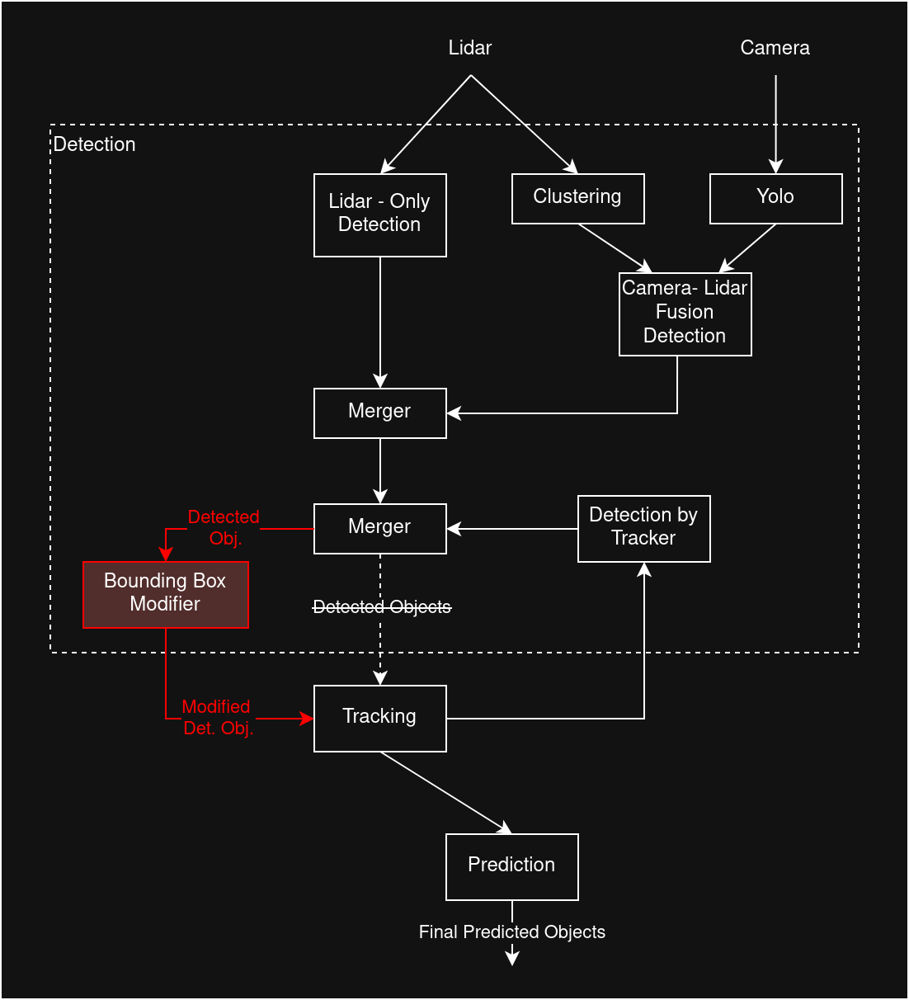

# Bounding Box Modifier

The bounding box modifier enables an easy way to simulate the effect of perception attacks by directly modifying the bounding boxes in Autoware. 

## Overview

Bounding boxes are modified at the end of the detection pipeline, before the detected objects are fed into tracking. (Other points of modification are also possible with slight modification.)

Therefore, a new ROS node is added that receives the original detected objects, modifies them and publishes the modified objects to a new topic. In Autoware topics are remapped accordingly. 

The implementation offers different functionality on how to modify the bounding boxes to enable the implementation of different attacks.



## Current Supported Functionality

Currently the following modifications are possible:

- Shifting bounding boxes in position: fixed and gradual shift over time
- Set new specific position of bounding box
- Changing size of bounding box
- Changing label (i.e. classification) of bounding box
- Drop bounding boxes completely

By filtering the attack can be adapted to specific objects. Currently available filters:

- Position Filter
- Label Filter

This enables to simulate e.g.: hiding attacks, misclassification attacks, attacks targeting tracking

## How to use

To implement a specific attack, create a yaml file specifying the concrete modifications and filters. A detailed explanation of the possibilities is included in the template yaml file (DO NOT MODIFY TEMPLATE DIRECTLY!)

In Autoware the topics need to be remapped accordingly. For the current implementation start Autoware with the following extra argument: `output/objects:=objects_raw`
Full command: 
```
ros2 launch autoware_launch e2e_simulator.launch.xml vehicle_model:=carla_t2_vehicle sensor_model:=carla_t2_sensor_kit map_path:=/home/carla/carla_aw_bridge/autoware/Town10/ perception_mode:=camera_lidar_fusion output/objects:=objects_raw
```

