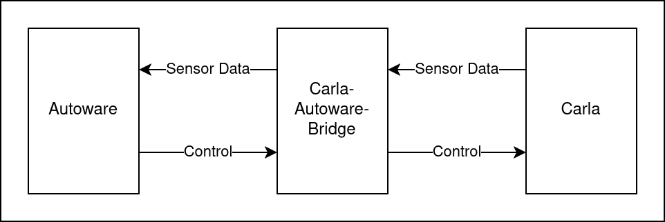

# Simulator - Running the Pipeline

This describes how to run the complete simulator pipeline manually.
(TODO: it might be helpful to put all of this into a script)

Carla, Autoware and the connecting bridge all run in seperate docker containers.
They should be started in the following order (as described below): Carla --> Bridge --> Autoware 

## Simulator Overview
Carla simulates the environment and generates all sensor data. Autoware simulates the actual AV, processing the sensor data and performing all control decisions. To ensure communication between Autoware and Carla the bridge translates sensor data from Carla into ROS messages and also transfers control messages from Autoware to Carla.



## Preparation
Run the following in a terminal: 
(TODO: in theory one could also make this persistent (at least the last 3))

``` 
sudo ip link set lo multicast on
sudo sysctl -w net.core.rmem_max=2147483647
sudo sysctl -w net.ipv4.ipfrag_time=3
sudo sysctl -w net.ipv4.ipfrag_high_thresh=134217728
```

## Starting Carla
In a terminal run:
```
docker run --privileged --gpus all --net=host -e DISPLAY=$DISPLAY carlasim/carla:0.9.15 /bin/bash ./CarlaUE4.sh -carla-rpc-port=1403 -quality-level=Low -prefernvidia
```

- `-carla-rpc-port` specifies the port (must fit to what is set for Bridge and Autoware)
- `-quality-level` sets the quality level of Carla (see Carla documentation)
- `-prefernvidia` might be required so Carla finds the correct GPU
- `-RenderOffScreen` to start Carla without visual output (especially useful if started over ssh connection)

## Starting the bridge (without any attack logic)
In another terminal run:
``` 
docker run -it -e RMW_IMPLEMENTATION=rmw_cyclonedds_cpp -e CYCLONEDDS_URI=file:///cyclonedds.xml --volume ~/cyclonedds.xml:/cyclonedds.xml -v ~/cypherAV/cypher-av/bridge/src/carla_autoware_bridge:/tum/src/carla_autoware_bridge --network host tumgeka/carla-autoware-bridge:latest 
```

- `~/cypherAV/cypher-av/bridge/src/carla_autoware_bridge` is the folder where the bridge code is stored

Then inside the docker run:
```
ros2 launch carla_autoware_bridge carla_aw_bridge.launch.py port:=1403 town:=Town10HD timeout:=60
```

- `port` must be the same port specified for Carla
- `town` the map that should be started
- `timeout` the time to wait for a response from Carla in seconds (if set too low the bridge might not start!)

## Starting Autoware
In a third terminal:
(On our setup first start the conda base environment as rocker is only installed there: `conda activate`)
```
rocker --network=host -e RMW_IMPLEMENTATION=rmw_cyclonedds_cpp -e LIBGL_ALWAYS_SOFTWARE=1 -e CYCLONEDDS_URI=file:///cyclonedds.xml --volume ~/cyclonedds.xml:/cyclonedds.xml --x11 --nvidia --volume /home/carla/carla_aw_bridge -- ghcr.io/autowarefoundation/autoware:humble-2024.01-cuda-amd64-keyfix
```
The docker takes a while to start up. To run the full AV stack, inside the docker run:
```
cd /home/carla/carla_aw_bridge/autoware/
source install/setup.bash
ros2 launch autoware_launch e2e_simulator.launch.xml vehicle_model:=carla_t2_vehicle sensor_model:=carla_t2_sensor_kit map_path:=/home/carla/carla_aw_bridge/autoware/Town10/ perception_mode:=camera_lidar_fusion
```

- `map_path` path to map. Replace with the actual path to the map
- `perception_mode` specifies the mode the perception is done in Autoware. To run with lidar only the argument is not requiered

## Running additional Carla Scripts
For example additional vehicles as a target, etc. can all be spawned via Python scripts. There are some example scripts in the \utils folder

In another terminal: 
- Find the docker container of the bridge: e.g. run `docker ps`
- Exec into the container: `docker exec -it [cont_name] bash`
- Then inside container run the scripts, e.g.:
```
cd src/carla_autoware_bridge/utils
python3 generate_traffic.py --config default_config.yaml
python3 generate_weather.py --config default_config.yaml
python3 set_route_vehicle_engage --config default_config.yaml  (need to run build script in dataset generation folder first! - see below)
```
- `--config` name of the config file. Default: 'default_config.yaml'

## Use Autoware ROS messages in the Bridge Container
To use autoware message in the bridge container run the following script:
```
cd src/carla_autoware_bridge/utils/dataset_collection/
./build_messages.sh 
```
If you then exec into the container sourcing of the workspace is necessary again: `source install/setup.bash`

